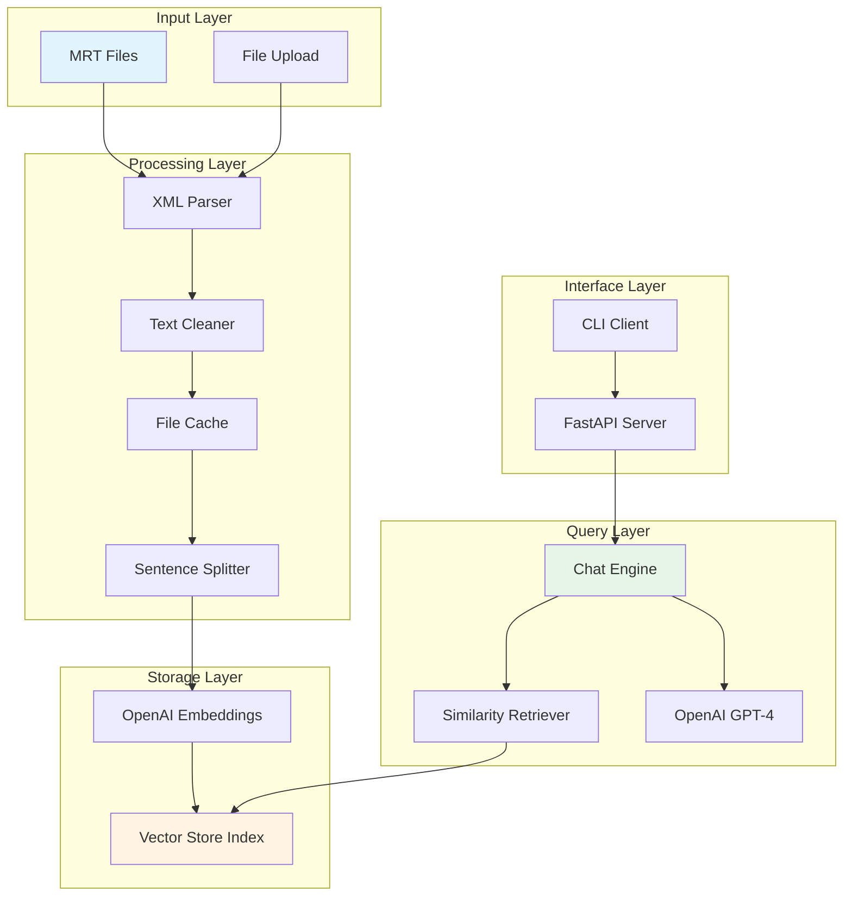

# ICSI Meeting Transcript Chatbot

A powerful RAG (Retrieval-Augmented Generation) chatbot for analyzing and querying the ICSI Meeting Corpus. Built with LlamaIndex, FastAPI, and OpenAI, this system provides both CLI and API interfaces for intelligent conversation analysis.

## 📋 Overview

The ICSI Chatbot processes Meeting Room Transcript (MRT) files from the ICSI corpus, creating a searchable knowledge base of meeting conversations. It uses advanced NLP techniques to parse, chunk, and index transcripts, enabling natural language queries about meeting content, participants, and topics.

**Key Features:**
- 🎯 Intelligent parsing of MRT XML files with metadata extraction
- 📝 Context-aware chunking optimized for conversational data
- 🔍 Semantic search using OpenAI embeddings
- 💬 Two interfaces: Interactive CLI and REST API
- 📦 Smart file caching to avoid reprocessing
- 🔐 Comprehensive logging for debugging and monitoring
- ✅ Full test coverage with pytest

## 🏗️ Architecture



## 🔧 Components

| Component | File | Description |
|-----------|------|-------------|
| **Main Entry** | `main.py` | Application entry point with CLI/API mode selection |
| **Configuration** | `src/config.py` | Environment-based configuration management |
| **Ingestion** | `src/ingestion.py` | MRT file parsing, text cleaning, and indexing |
| **File Processor** | `src/file_processor.py` | File validation and processing for uploads |
| **File Cache** | `src/file_cache.py` | Content-based caching using SHA-256 hashing |
| **Chat Engine** | `src/chat_engine.py` | LlamaIndex-based conversational interface |
| **API Server** | `src/api.py` | FastAPI REST endpoints for file upload and chat |
| **CLI Client** | `src/cli.py` | Interactive command-line interface |
| **Logger** | `src/logger.py` | Centralized logging configuration |

## 📄 Document Processing Pipeline

### 1. **XML Parsing**
The system parses MRT (Meeting Room Transcript) XML files following ICSI corpus conventions:

```python
# Extract meeting metadata
- Meeting ID (e.g., Bmr001)
- Session info and timestamps
- Meeting type (db, ed, mr, ns, ro, sr, tr, uw)
- Participant information
- Duration and timing data
```

**Key Features:**
- Filters out digit task segments (non-conversational data)
- Extracts speaker IDs with gender/language metadata
- Preserves temporal information (start/end times)

### 2. **Text Cleaning**
Sophisticated cleaning pipeline that:

- **Preserves Context**: Converts XML markers to readable format
  - `<VocalSound Description="laugh"/>` → `[laugh]`
  - `<Pause/>` → `...`
  - `<Uncertain>word</Uncertain>` → `(word?)`

- **Normalizes Text**: 
  - Decodes HTML entities
  - Converts acronym notation: `O_K` → `OK`, `P_D_A` → `PDA`
  - Removes empty utterances and noise

- **Maintains Structure**:
  - Speaker labels: `[me011]: utterance text`
  - Chronological ordering of utterances

### 3. **Chunking Strategy**

Uses **SentenceSplitter** for intelligent chunking:

```python
Chunk Size: 512 tokens (configurable)
Chunk Overlap: 50 tokens (configurable)
```

**Why Sentence-Based Chunking?**
- Preserves conversational context
- Respects natural speech boundaries
- Maintains speaker attribution
- Optimized for meeting transcript structure

**Metadata Preservation:**
Each chunk retains:
- Meeting ID and session info
- Speaker list and count
- Meeting type and description
- Timestamps and duration
- Source file reference

### 4. **Embedding & Indexing**

- **Embedding Model**: `text-embedding-3-small` (OpenAI)
- **Vector Store**: LlamaIndex VectorStoreIndex
- **Persistence**: Stored in `storage/` directory for reuse

## 🚀 Getting Started

### Prerequisites

- Python 3.8+
- OpenAI API key
- ICSI Meeting Corpus MRT files

### Installation

1. **Clone the repository**
```bash
git clone https://github.com/Suhrud0811/natter-icsi-chatbot.git
cd natter-icsi-chatbot
```

2. **Create virtual environment**
```bash
python -m venv venv

# Windows
venv\Scripts\activate

# Linux/Mac
source venv/bin/activate
```

3. **Install dependencies**
```bash
pip install -r requirements.txt
```

4. **Configure OpenAI API Key**

Create a `.env` file in the project root:

```env
# Required
OPENAI_API_KEY=your_openai_api_key_here

# Optional - Model Configuration
OPENAI_MODEL=gpt-4o-mini
EMBEDDING_MODEL=text-embedding-3-small

# Optional - Chunking Settings
CHUNK_SIZE=512
CHUNK_OVERLAP=50

# Optional - Retrieval Settings
SIMILARITY_TOP_K=5
CHAT_MEMORY_TOKEN_LIMIT=3000

# Optional - API Settings
API_HOST=0.0.0.0
API_PORT=8000

# Optional - File Upload Settings
MAX_FILE_SIZE_MB=10
MAX_FILES_PER_UPLOAD=5
```

5. **Download ICSI Corpus**

Download MRT files from [ICSI Corpus](https://groups.inf.ed.ac.uk/ami/icsi/download/) and place them in:
```
data/transcripts/
```

## 🎮 Usage

### Option 1: CLI Mode (Interactive)

Start the API server (in one terminal):
```bash
python main.py api
```

Run the CLI client (in another terminal):
```bash
python main.py cli
```

**CLI Commands:**
```
upload <file.mrt>     # Upload a meeting transcript
files                 # List uploaded files
clear                 # Clear all uploaded files
quit or exit          # Exit the chatbot
```

**Example Session:**
```
You: upload data/transcripts/Bmr001.mrt
✓ Processed: Bmr001.mrt
Total files in system: 1

You: What topics were discussed in this meeting?
Assistant: Based on the transcript, the main topics discussed were...

You: Who were the main participants?
Assistant: The meeting had 4 participants: me011, fn002, me013, and fn003...
```

### Option 2: API Mode (Programmatic)

Start the server:
```bash
python main.py api
```

The API will be available at `http://localhost:8000`

**API Endpoints:**

| Endpoint | Method | Description |
|----------|--------|-------------|
| `/health` | GET | Health check |
| `/upload` | POST | Upload MRT files |
| `/chat` | POST | Send chat message |
| `/files` | GET | List uploaded files |
| `/files` | DELETE | Clear all files |

**Example API Usage:**
```bash
# Upload a file
curl -X POST "http://localhost:8000/upload" \
  -F "files=@data/transcripts/Bmr001.mrt"

# Chat
curl -X POST "http://localhost:8000/chat" \
  -H "Content-Type: application/json" \
  -d '{"message": "What was discussed in the meeting?"}'

# List files
curl "http://localhost:8000/files"
```

**API Documentation:**
Visit `http://localhost:8000/docs` for interactive Swagger UI documentation.

## 🧪 Testing

The project includes comprehensive test coverage:

```bash
# Run all tests
pytest

# Run with coverage report
pytest --cov=src --cov-report=html

# Run specific test file
pytest tests/test_ingestion.py -v

# Run with detailed output
pytest -v --tb=short
```

**Test Structure:**
```
tests/
├── test_ingestion.py      # MRT parsing and indexing tests
├── test_chat_engine.py    # Chat engine functionality tests
└── test_api.py            # API endpoint tests
```

## 📊 Configuration Options

All settings can be configured via environment variables in `.env`:

| Variable | Default | Description |
|----------|---------|-------------|
| `OPENAI_API_KEY` | *required* | Your OpenAI API key |
| `OPENAI_MODEL` | `gpt-4o-mini` | GPT model for chat |
| `EMBEDDING_MODEL` | `text-embedding-3-small` | Embedding model |
| `CHUNK_SIZE` | `512` | Token size per chunk |
| `CHUNK_OVERLAP` | `50` | Overlap between chunks |
| `SIMILARITY_TOP_K` | `5` | Number of chunks to retrieve |
| `CHAT_MEMORY_TOKEN_LIMIT` | `3000` | Conversation memory limit |
| `API_HOST` | `0.0.0.0` | API server host |
| `API_PORT` | `8000` | API server port |
| `MAX_FILE_SIZE_MB` | `10` | Max upload file size |
| `MAX_FILES_PER_UPLOAD` | `5` | Max files per upload |

## 📁 Project Structure

```
natter-icsi-chatbot/
├── data/
│   └── transcripts/          # MRT files go here
├── logs/
│   └── chatbot.log          # Application logs
├── prompts/
│   └── system_prompts.txt   # System prompt for chat
├── src/
│   ├── __init__.py
│   ├── api.py               # FastAPI server
│   ├── chat_engine.py       # Chat interface
│   ├── cli.py               # CLI client
│   ├── config.py            # Configuration
│   ├── file_cache.py        # File caching
│   ├── file_processor.py    # File processing
│   ├── ingestion.py         # MRT parsing & indexing
│   └── logger.py            # Logging setup
├── storage/                 # Vector index storage
├── tests/                   # Test suite
├── .env                     # Environment variables (create this)
├── main.py                  # Entry point
├── requirements.txt         # Dependencies
└── README.md               # This file
```

## 🔍 Logging

The application uses comprehensive logging:

- **Console Output**: INFO level and above
- **File Output**: `logs/chatbot.log` with DEBUG level
- **Format**: Timestamped with module and level information

**Log Levels:**
- `DEBUG`: Detailed processing information
- `INFO`: General operations (startup, file processing)
- `WARNING`: Validation failures, rejected operations
- `ERROR`: Exceptions with full stack traces

## 🤝 Contributing

Contributions are welcome! Please:

1. Fork the repository
2. Create a feature branch
3. Add tests for new functionality
4. Ensure all tests pass
5. Submit a pull request

## 📝 License

This project is licensed under the MIT License - see the LICENSE file for details.

## 🙏 Acknowledgments

- **ICSI Meeting Corpus**: [https://groups.inf.ed.ac.uk/ami/icsi/](https://groups.inf.ed.ac.uk/ami/icsi/)
- **LlamaIndex**: For the powerful RAG framework
- **OpenAI**: For embeddings and language models

## � Support

For issues, questions, or contributions, please open an issue on GitHub.

---

**Built with ❤️ for meeting analysis and conversation understanding**
